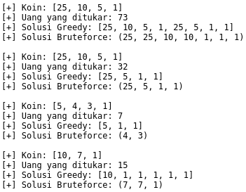

# Penukaran Koin Dengan Algoritma Greedy

## Language

-  

## Tools

- 

## Test coverage

-  python

## Documentation

- Penukaran Koin 
    
    
    Diberikan uang senilai A. Tukar A dengan koin-koin uang yang ada.  
    Berapa jumlah minimum koin yang diperlukan untuk penukaran tersebut?

    - **Contoh 1 :**  
    
        - Terdapat koin **1, 5, 10, 25**   
        - Jika sejumlah uang sebesar **32** ingin ditukarkan dengan koin, berapa minimal koin yang didapat.
        - 32 = 1 + 1 + … + 1 &nbsp;&nbsp;&nbsp;&nbsp;&nbsp;&nbsp;&nbsp;&nbsp;&nbsp;&nbsp;&nbsp;&nbsp;&nbsp;&nbsp;&nbsp;&nbsp;&nbsp;&nbsp;&nbsp;&nbsp;&nbsp;&nbsp;&nbsp; (32 koin)   
        - 32 = 5 + 5 + 5 + 5 + 10 + 1 + 1 &nbsp;&nbsp; (7 koin)   
        - 32 = 10 + 10 + 10 + 1 + 1 &nbsp;&nbsp;&nbsp;&nbsp;&nbsp;&nbsp;&nbsp;&nbsp;&nbsp;&nbsp; (5 koin)   
        - ... dst             
        - **Minimum: 32 = 25 + 5 + 1 + 1 &nbsp;&nbsp; (4 koin)**   
    
    - **Contoh 2 :**  
    
        - Terdapat koin **5, 10, 25, 50**     
        - Jika sejumlah uang sebesar **65** ingin ditukarkan dengan koin, berapa minimal koin yang didapat.  
        - 65 = 5 + 5 + … + 5 &nbsp;&nbsp;&nbsp;&nbsp;&nbsp;&nbsp;&nbsp;&nbsp;&nbsp;&nbsp;&nbsp;&nbsp;&nbsp;&nbsp;&nbsp;&nbsp;&nbsp;&nbsp;&nbsp;&nbsp;&nbsp;&nbsp;&nbsp;&nbsp;(13 koin)
        - 65 = 10 + 5 + 5 + 5 + 5 + .. + 5 &nbsp;&nbsp; (12 koin)
        - 65 = 10 + 10 + 5 + 5 + .. + 5 &nbsp;&nbsp;&nbsp;&nbsp;&nbsp;&nbsp; (11 koin)
        - 65 = 10 + 10 + .. + 10 + 5 &nbsp;&nbsp;&nbsp;&nbsp;&nbsp;&nbsp;&nbsp;&nbsp;&nbsp;&nbsp;&nbsp; (7 koin)
        - 65 = 25 + 25 + 10 + 5 &nbsp;&nbsp;&nbsp;&nbsp;&nbsp;&nbsp;&nbsp;&nbsp;&nbsp;&nbsp;&nbsp;&nbsp;&nbsp;&nbsp;&nbsp;&nbsp;&nbsp;&nbsp; (4 koin)
        - 65 = 50 + 5 + 5 + 5  &nbsp;&nbsp;&nbsp;&nbsp;&nbsp;&nbsp;&nbsp;&nbsp;&nbsp;&nbsp;&nbsp;&nbsp;&nbsp;&nbsp;&nbsp;&nbsp;&nbsp;&nbsp;&nbsp;&nbsp;&nbsp;&nbsp; (4 koin)
        - 65 = 50 + 10 + 5 &nbsp;&nbsp;&nbsp;&nbsp;&nbsp;&nbsp;&nbsp;&nbsp;&nbsp;&nbsp;&nbsp;&nbsp;&nbsp;&nbsp;&nbsp;&nbsp;&nbsp;&nbsp;&nbsp;&nbsp;&nbsp;&nbsp;&nbsp;&nbsp;&nbsp;&nbsp; (3 koin)
        - **Minimum: 65 = 50 + 10 + 5 &nbsp;&nbsp;&nbsp;&nbsp;&nbsp;&nbsp; (3 koin)**
    
    - **Contoh 3 :**  
    
        - Terdapat koin **1, 3, 4, 5**   
        - Jika sejumlah uang sebesar **7** ingin ditukarkan dengan koin, berapa minimal koin yang didapat.
        - Solusi greedy: &nbsp; 7 = 5 + 1 + 1 &nbsp;&nbsp;  ( 3 koin) ? **tidak optimal**        
        - Solusi optimal: 7 = 4 + 3 &nbsp;&nbsp;&nbsp;&nbsp;&nbsp;&nbsp;&nbsp;&nbsp;&nbsp; ( 2 koin)   
    
    - Jika jawaban terbaik mutlak TIDAK diperlukan, 
    maka algoritma greedy sering berguna untuk menghasilkan solusi hampiran (approximation),  
    daripada menggunakan algoritma yang lebih rumit untuk menghasilkan solusi yang eksak.
    
- Kesimpulan :  
  Algoritma greedy membentuk solusi langkah  per langkah. 
  Pada setiap langkah terdapat banyak pilihan yang perlu dieksplorasi. 
  Sehingga, pada setiap langkah harus dibuat keputusan yang terbaik dalam menentukan pilihan 
  (keputusan yang telah diambil pada suatu langkah tidak dapat diubah lagi pada langkah selanjutnya). 
  Pada setiap langkah  membuat pilihan optimum lokal dengan harapan bahwa langkah sisanya mengarah kesolusi optimum global.

- ScreenShot 1

    

- ScreenShot 2

    

- ScreenShot 3

    
    
- ScreenShot 4

    
    

## License
> This program is Free Software: 
You can use, study, share and improve it at your will. 
Specifically you can redistribute and/or modify it under the terms of the [GNU General Public License](https://www.gnu.org/licenses/gpl.html) 
as published by the Free Software Foundation, either version 3 of the License, or (at your option) any later version.
